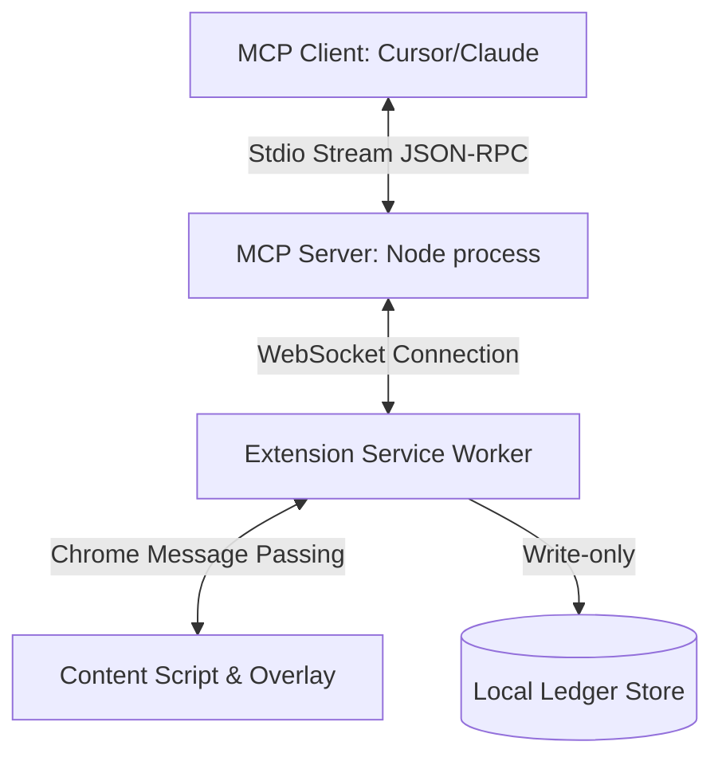

# Architecture & Security Boundary Guide

This document describes the design, communication paths, and trust boundaries of the MiraiLens system.

---

## 1. Technical Architecture Overview

MiraiLens consists of three distinct components communicating sequentially:



### Communication Flow
1. **MCP Client → MCP Server**: The client initiates stdio calls requesting browser actions (e.g. `mcp_mirailens_click` with selector `#btn-pay`).
2. **MCP Server → Service Worker**: The server converts standard MCP JSON-RPC requests into internal WebSocket frame commands and transmits them to the browser extension background script.
3. **Service Worker → Policy Validation**: The extension intercepts the command, checks the current state machine, and evaluates target hostname safety rules against user policies.
4. **Service Worker → Content Script**: If approval is required, the background worker orders the tab content script to generate a human approval overlay.
5. **Human Approval Overlay**: The user clicks **APPROVE** or **DENY** on the screen. The event translates back to the background worker.
6. **Execution & State Snapshot**: If approved, the background script executes the action. For inputs, it captures the pre-value snapshot.
7. **Verification Transition**: Once completed, the extension switches to `STATES.VERIFYING` and triggers checks (checking element values or URL redirects) before writing the final status outcome to the Local Ledger.

---

## 2. Trust Boundaries & Security Model

The security model of MiraiLens is designed defensively around the browser sandbox:

```text
               +--------------------------------------+
               |          UNTRUSTED BOUNDARY          |
               |                                      |
               |   [MCP Client]   --->   [MCP Server]  |
               +--------------------------------------+
                                  |
==================================|===================================
               +------------------v-------------------+
               |           TRUSTED BOUNDARY           |
               |                                      |
               |  [Extension Background Service]      |
               |            |                         |
               |            +---> [Human Overlays]    |
               |            +---> [Local Storage]     |
               |                                      |
               |            [Enforcement Authority]   |
               +--------------------------------------+
```

### Trust Guarantees
- **The MCP Server is NOT a Security Boundary**: The server is a message broker that coordinates stdio transport streams. It resides in the untrusted boundary because compromised AI models or server configurations must not have unchecked access to the browser.
- **The Browser Extension is the Sole Enforcement Authority**: The extension service worker validates policies, enforces Draft-Only protections, monitors sensitive field accesses, tracks human confirmations, and verifies output states. Even if the MCP Server sends corrupted requests, the extension service worker prevents execution unless policies allow.
- **Local Ledger Immutability Limits**: The ledger is recorded inside Chrome's sandbox storage (`chrome.storage.local`). While it prevents modification from host pages, it is not cryptographically signed. It represents a high-integrity local logging mechanism rather than a distributed proof.
